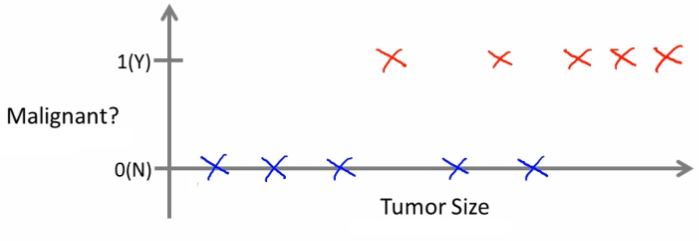
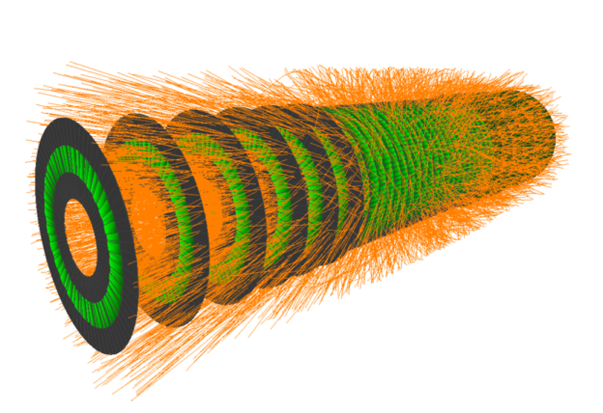

class: center, middle


# Introduction to Machine Learning
### Raphael Cobe
### Advanced Institute for Artificial Intelligence
### June, 2019

---
class: center, middle


# http://advancedinstitute.ai

```{r setup, include=FALSE}
options(htmltools.dir.version = FALSE)
```


---
class: center, middle, inverse

# A little bit more of Machine Learning
#### Some of the slides were borrowed from Andrew Ng Coursera Course.

---
class: left
# Machine Learning
## Some example applications

* Database mining
  + Machine learning has recently become so big party because of the huge amount of data being generated
  + Sources of data include
    + Web data (click-stream or click through data)
      + Mine to understand users better
    + Medical records
      + Electronic records -> turn records in knowledges
    + Biological data
      + Gene sequences, ML algorithms give a better understanding of human genome
    + Engineering info
      + Data from sensors, log reports, photos etc

---
class: left
# Machine Learning
## Some example applications

* Applications that **we cannot program by hand**
  + Autonomous vehicles
  + Handwriting recognition
    + Very inexpensive, and allows algorithms can automatically route envelopes through the post
  + Natural language processing (NLP)
  + Computer vision
* Self customizing programs
  + Netflix, Amazon, iTunes
  + Take users info
    + Learn based on your behavior
* Understand human learning and the brain
  + If we can build systems that mimic (or try to mimic) how the brain works, this may push our own understanding of the associated neurobiology


---
class: left
# Machine Learning
## Not a well defined definition

* Arthur Samuel (1959)

> Field of study that gives computers the ability to learn without being explicitly programmed

* Tom Michel (1999)

> A computer program is said to learn from experience E with respect to some class of tasks T and performance measure P, if its performance at tasks in T, as measured by P, improves with experience E.

* The checkers example: 
  + E = 10000s games
  + T is playing checkers
  + P if you win or not

???
* Couple of examples of how people have tried to define it
* Samuels wrote a checkers playing program
  + Had the program play 10000 games against itself
  + Work out which board positions were good and bad depending on wins/losses


---
class: left
# Machine Learning 
## Kinda how humans evolve by learning

The Cassava Leaf in the North of Brazil

```{r, out.width = "500px", fig.align="center", echo=FALSE}

```

???
* Leaf of the Manioc
* Yuca
* Cassava roots, peels and leaves should not be consumed raw because they contain;
* Used in Brazilians Maniçoba - some kind of stew;
* Learning how to cook it:
  + E = 7h cooking
  + T is eating Manioc Leafs
  + P if you live or not
  
---
class: left
# Machine Learning
## Several types of learning algorithms
* Supervised learning
  + Teach the computer how to do something, then let it use it;s new found knowledge to do it
* Unsupervised learning
  + Let the computer learn how to do something, and use this to determine structure and patterns in data
* Reinforcement learning
* Recommender systems

---
class: left
# Supervised learning - introduction
* Probably the most common problem type in machine learning
* Starting with an example: 
  * How do we predict housing prices
  * Collect data regarding housing prices and how they relate to size in feet

```{r, out.width = "500px", fig.align="center", echo=FALSE}
knitr::include_graphics("images/lr1.png")
```

Example problem: "Given this data, if I have a house 750 square feet - how much can I expect to get?"

---
class: left
# Supervised learning - introduction
## What approaches can we use to solve this?
* Straight line through data
  * Maybe $150 000
* Second order polynomial
  * Maybe $200 000
* One thing we discuss later - how to chose straight or curved line?
* Each of these approaches represent a way of doing supervised learning
  
---
class: left
# Supervised learning - introduction
## What does this mean? 
* We gave the algorithm a data set where a "right answer" was provided
* So we know actual prices for houses
  * The idea is we can learn what makes the price a certain value from the training data
  * The algorithm should then produce more right answers based on new training data where we don't know the price already
    * i.e. predict the price

## Regression problem
* Predict continuous valued output (price)
* No real discrete delineation 

---
class: left
# Supervised learning - introduction
## Another Example

* Can we definer breast cancer as malignant or benign based on tumour size

```{r, out.width = "500px", fig.align="center", echo=FALSE}

```

Can you estimate prognosis based on tumor size?

---
class: left
# Supervised learning - introduction
## Another Example continued

* This is an example of a **classification problem**
  * Classify data into one of two discrete classes - no in between, either malignant or not
  * In classification problems, can have a discrete number of possible values for the output e.g., maybe have four values:
    * 0 - benign
    * 1 - type 1
    * 2 - type 2
    * 3 - type 4

---
class: left
# Supervised learning - introduction
## Another Example continued    

* In other problems may have multiple attributes
  * We may also, for example, know age and tumor size:
  
```{r, out.width = "500px", fig.align="center", echo=FALSE}
knitr::include_graphics("images/lr3.png")
```

---
class: left
# Unsupervised learning - introduction
* Second major problem type
  * In unsupervised learning, we get unlabeled data
  * Just told - here is a data set, can you structure it
* One way of doing this would be to cluster data into to groups
  * This is a **clustering algorithm**

---
class: left
# Unsupervised learning - introduction
## Clustering - examples
* Google news
  * Groups news stories into cohesive groups
* Genomics
  * Run algorithm to cluster individuals into types of people
* Organize computer clusters
  * Identify potential weak spots or distribute workload effectively
* Social network analysis
  * Customer data
  
Can you automatically generate structure?

Because we don't give it the answer, it's **unsupervised learning**

---
class: center, middle, inverse

# Linear Regression

---
class: left, middle

# Get Started
### Regression analysis is used to describe the relationship between:
* A single response variable: $Y$ ; and
* One or more predictor variables: $X_1$, $X_2$,..., $X_n$
    + $n = 1$: Simple Regression
    + $n > 1$: Multivariate Regression

---
class: left
# The cars R dataset: Speed and Stopping Distances of Cars
## Load the dataset into a variable
```{r, echo=TRUE}
cars.dataset <- cars;
```
--
## Check the first lines of the dataset:
```{r, echo=TRUE}
head(cars.dataset);
```

---
# Check the summary of the data
```{r, echo=TRUE}
summary(cars.dataset);
```
---
# Check scatterplot
```{r, echo=TRUE, out.width = "400px", fig.align="center"}
plot(cars.dataset);
```
---
class: left, middle
# Linear Regression

* Model a continuous variable $Y$ ( $y_1, y_2, ..., y_m$ ) as a function of one or more $X^j$ variable(s);

$$y_i=\theta_0 + \theta_1X_i^1 + \theta_2X_i^2+...+\theta_nX_i^n$$

* Build a model to predict $\widehat{y}_i$ values when the $X^j$ features are known;

$$\widehat{y_i}=\theta_0 + \theta_1X_i^1 + \theta_2X_i^2+...+\theta_nX_i^n + \epsilon_i$$


* Unless an $\epsilon$ error.

---
class: middle

# Linear Regression
## Matrix Notation

$$\widehat{y_i}=\begin{bmatrix} \theta_0 & \theta_1 &\theta_2 & ... & \theta_n\end{bmatrix} \begin{bmatrix} X_i^0 \\ X_i^1 \\ X_i^2 \\ ... \\ X_i^n\end{bmatrix}+\epsilon_i$$
$$\widehat{y_i}=\Theta^TX_i + \epsilon_i$$

---
class: middle

# Linear Regression
## Matrix Notation

$$\widehat{y_i}=\begin{bmatrix}X_i^0 & X_i^1 & X_i^2 & ... & X_i^n\end{bmatrix} \begin{bmatrix}\theta_0 \\ \theta_1 \\ \theta_2 \\ ... \\ \theta_n\end{bmatrix} +\epsilon_i$$
$$\widehat{y_i}=[{X_i}]^T\Theta + \epsilon_i$$
---
class: middle

# Linear Regression
## Matrix Notation - For all observations:

$$\begin{bmatrix}\widehat{y_1} \\ \widehat{y_2} \\ ... \\ \widehat{y_m}\end{bmatrix} = \begin{bmatrix}X_1^0 & X_1^1 & ... & X_1^n \\ X_2^0 & X_2^1 & ... & X_2^n \\ ...& ... &... & ...\\X_m^0 & X_m^1 & ... & X_m^n  \end{bmatrix} \begin{bmatrix}\theta_0 \\ \theta_1 \\ ... \\ \theta_n\end{bmatrix} + \begin{bmatrix}\epsilon_1 \\ \epsilon_1 \\ ... \\ \epsilon_m\end{bmatrix}$$
$$\widehat{Y}=X\Theta+\epsilon$$


---
class: middle
# Simple Linear Regression
### Using a single predictor:
$$
\widehat{y_i}=\theta_0 + \theta_1X_i^1+\epsilon_i
$$

#### Where:
* $\theta_0$ (Intercept): point in which the line intercepts the y-axis;
* $\theta_1$ (Slope): increase in Y per unit change in X.

---
# Simple Linear Regression
### For the equation:
$$y = 10x+5$$
```{r, echo=FALSE, out.width = "400px", fig.align="center"}
plot(x=c(0), y=(5), xlim=c(0,4), ylim=c(4,10))
abline(a=5, b=1)
```

---
class:middle
# Simple Linear Regression
We want to find the equation of the line that *best* fits the data.
It means finding $\theta_0$ and $\theta_1$ such that the fitted values of $\widehat{y_i}$, given by
$$
\widehat{y_i} = \theta_0+\theta_1X_i^1+\epsilon_i
$$
are as *close as possible* to the observed values $y_i$, i.e., bring each $\epsilon_i$ to **as close to 0 as possible**.

---
class:middle
# Simple Linear Regression
## Residuals

* The difference between the observed value $y_i$ and the fitted value $\widehat{y_i}$:

$$
e_i = \widehat{y_i} - y_i
$$
---
class:middle
# Simple Linear Regression
## Residuals

* The difference between the observed value $y_i$ and the fitted value $\widehat{y_i}$

```{r, out.width = "600px", fig.align="center", echo=FALSE}

```

---
class:middle
#Simple Linear Regression 
A usual way of calculating $\theta_0$ and $\theta_1$ is based on the minimization
of the **R**esidual **S**um of **S**quares (*RSS*):
$$\begin{eqnarray}
RSS &=& \frac{1}{2m}\sum_{i=0}^{m}[\epsilon_i]^2 \\
&=& \frac{1}{2m}\sum_{i=0}^{m}(\widehat{y}_i-y_i)^2\\
&=& \frac{1}{2m}\sum_{i=0}^{m}(\theta_0 + \theta_1X_i^1-y_i)^2
\end{eqnarray}$$

**Also known as our Cost function!**

---
# Simple Linear Regression

Let's examine the Error $\epsilon$ in terms of the $\theta_0$ and $\theta_1$ params:

```{r, out.width = "700px", fig.align="center", echo=FALSE}

```

---
class: middle
# Simple Linear Regression
## The Gradient
The gradient of a vector is a generalization of the derivative and is represented by the vector operator $\Delta$. This operation is used to minimize the our cost function (*RSS*):
$$\begin{eqnarray}
\Delta RSS(\Theta)&=&\Delta[\frac{1}{2m}\sum_{i=0}^m(\widehat{y_i}-y_i)^2]\\
&=& \Delta[\frac{1}{2}\sum_{i=0}^{m}(\theta_0 + \theta_1X_i^1 - y_i)^2]\\
&=& [\frac{\partial}{\partial \theta_0}(\frac{1}{2m}\sum_{i=0}^{m}(\theta_0 + \theta_1X_i^1-y_i)^2),\frac{\partial}{\partial \theta_1}(\frac{1}{2m}\sum_{i=0}^{m}(\theta_0 - \theta_1X_i^1-y_i)^2)]
\end{eqnarray}$$

---
class: middle
# Simple Linear Regression
## The Gradient Continued
$$\begin{eqnarray}
\frac{\partial RSS}{\partial \theta_0} &=& \frac{\partial}{\partial \theta_0}(\frac{1}{2m}\sum_{i=0}^{m}(\theta_0 + \theta_1X_i^1-y_i)^2)\\
&=& \frac{1}{m}\sum_{i=0}^{m}(\theta_0X_i^0 + \theta_1X_i^1-y_i)\end{eqnarray}$$
---
class: middle
# Simple Linear Regression
## The Gradient Continued
$$\begin{eqnarray}
\frac{\partial RSS}{\partial \theta_1} &=& \frac{\partial}{\partial \theta_1}(\frac{1}{2m}\sum_{i=0}^{m}(\theta_0 + \theta_1X_i^1-y_i)^2)\\
&=& \frac{1}{m}\sum_{i=0}^{m}((\theta_0X_i^0 + \theta_1X_i^1-y_i)X_i^1)\end{eqnarray}$$
---
class: middle
# Simple Linear Regression
## The Analytical Solution:
$$\begin{eqnarray}
\frac{\partial RSS}{\partial \theta_0} &=& 0\\
\theta_0 &=& \frac{\sum_{i=0}^{m}y_i}{m} - \theta_1\frac{\sum_{i=0}^{m}X_i^1}{m}\\
\end{eqnarray}$$
---
class: middle
# Simple Linear Regression
## The Analytical Solution

$$\begin{eqnarray}
\frac{\partial RSS}{\partial \theta_1} &=& 0\\
0 &=& \sum_{i=0}^{m}y_iX_i^1 - \sum_{i=0}^{m}\theta_0X_i^1 - \sum_{i=0}^{m}\theta_1(X_i^1)^2
\end{eqnarray}$$
--
Substituting $\theta_0$... and doing some math:
$$\begin{eqnarray}
\theta_1 &=& \frac{\sum_{i=0}^{m}y_iX_i^1-\frac{\sum_{i=0}^{m}y_i\sum_{i=0}^{m}X_i^1}{m}}{\sum_{i=0}^{m}(X_i^1)^2-\frac{(\sum_{i=0}^{m}(X_i^1))^2}{m}}
\end{eqnarray}$$
Which is the same as $\frac{Cov(X^1,Y)}{Var(X^1)}$.

---
class: middle
# Simple Linear Regression
## The Analytical Solution
By transforming the previous equation into its Vectorial form:
$$\Theta = (X^TX)^{-1}X^TY$$
---
class: top
# Simple Linear Regression
## Drawbacks of using the Analytical Solution
* $X^TX$ is not always invertible;
* Complexity of the inverse is of the order $O(n^3)$:
  + If the number of features is high, it can become **computationally very expensive**;
  
--
  + Consumes a lot of memory:
--

Imagine a dataset containing $10^5$ features and $10^6$ observations, in this case $X^TX$ would have $10^5$ floating points, which at 8 bytes per number would give **80 gigabytes**, with the $O(n^3)$ that can get a lot worse;

---
class: middle
# Simple Linear Regression
## The Gradient Descent
Iteratively correct the $\Theta$ weight matrix with: 
$$\begin{eqnarray}
\theta_0^{(t+1)} &=& \theta_0^{(t)} - \alpha \frac{\partial RSS}{\partial \theta_0}\\
\theta_1^{(t+1)} &=& \theta_1^{(t)} - \alpha \frac{\partial RSS}{\partial \theta_1}
\end{eqnarray}$$

Where $\alpha$ is the Learning Rate, i.e. the stepsize torwards the the minimum cost value;
---
class: middle
# Simple Linear Regression
## The Gradient Descent Algorithm
$$while\ ||\frac{\partial RSS}{\partial \Theta}|| > v \\
\theta_0^{(t+1)} = \theta_0^{(t)} - 2\alpha\sum_{i=0}^{m}(\theta_0X_i^0 + \theta_1X_i^1-y_i)\\
\theta_1^{(t+1)} = \theta_1^{(t)} - 2\alpha(\sum_{i=0}^{m}(\theta_0X_i^0 + \theta_1X_i^1-y_i)X_i^1)$$

Where 
$\left\|\frac{\partial}{\partial \Theta} R S S\left(\Theta^{(t)}\right)\right\|=\sqrt{\frac{\partial}{\partial \theta_0} R S S\left(\theta_{0}^{(t)}\right)^{2}+\frac{\partial}{\partial \theta_1} R S S\left(\theta_{1}^{(t)}\right)^{2}}$

---
class: middle
# Linear Regression
## The general case
$$\begin{eqnarray}
\Delta RSS(\Theta) &=& \Delta[\frac{1}{2}(X\Theta-y)^T (X\Theta-y)]\\
&=& X^T(X\Theta-y)
\end{eqnarray}$$
Ref.: $\frac{d}{d\theta}(x\theta-y)(x\theta-y) = 2x(x\theta-y)$

---
class: middle
# Linear Regression
## The general case
Feature by feature update:
$$\frac{\partial RSS(\theta_j)}{\partial \theta_j} = \sum_{i=0}^{m}2(y_i - \theta_0*X_i^0 - \theta_1*X_i^1 -\ ...\ -\ \theta_n*X_i^n) * (-X_i^j)$$

---
class: middle

# Assessing the Model quality
## Residual Standard Error - *RSE*:

* Derived from the Residual Sum of Squares - RSS;
* Associated with each observation is an error term $\epsilon$:

$$y_i = \theta_0+\theta_1X_i^1+\epsilon_i$$

* Even if we knew the true regression line, we would not be able to perfectly predict $Y$ from $X$;
* The RSE is an estimate of the standard deviation of $\epsilon$;
* **The average amount that the response will deviate from the true regression line**

---
class: middle

# Assessing the Model quality
## Residual Standard Error - *RSE*:

* a measure of the lack of fit of the model to the data;
* If the predictions obtained using the model are very close to the true outcome:
    + RSE will be small, and we can conclude that the model fits the data very well;
* If $\widehat{y}_i$ is very far from $y_i$ for one or more observations, then:
    + The RSE may be quite large, indicating that the model doesn't fit the data well;

---
class: middle

# Assessing the Model quality
## The $R^2$

* Provides an alternative measure to RSE;
* "*Unitless*";
* The proportion of variance explained;
* Always takes on a value between 0 and 1;
* Independent of the scale of $Y$;

---
class: middle

# Assessing the Model quality
## The $R^2$

* Statistic close to 1:
    + A large proportion of the variability in the response has been explained by the regression. 
* A value near 0:
    + Indicates that the regression did not explain much of the variability in the response;
* it can still be challenging to determine what is a good $R^2$ value;
    + depend on the application;

---
class: center, middle, inverse

# Demo time!

---
class: left
# The Exercises

The barrel calorimeter
```{r, out.width = "500px", fig.align="center", echo=FALSE}

```

---
class: center, middle

# Thanks!

Slides created via the R package [**xaringan**](https://github.com/yihui/xaringan).

